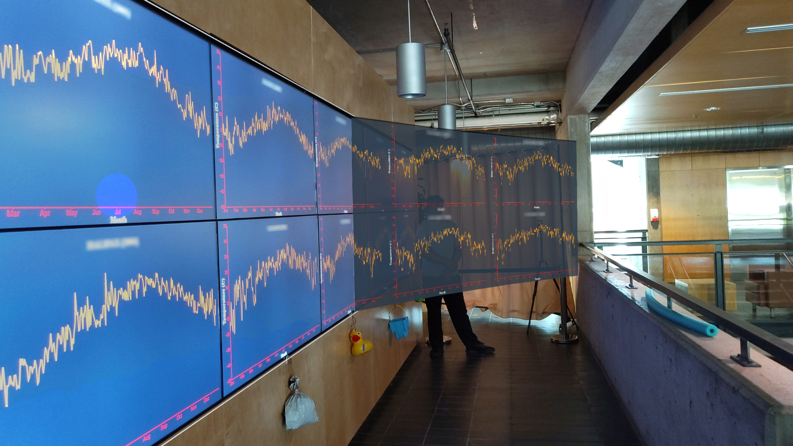

# PerspectAR: Addressing Perspective Distortion on Very Large Displays with Adaptive Augmented Reality Overlays

PerspectAR is a perspective-compensated interface using an augmented reality headset. The project consists of two main parts:

1. Compiling and Running the PerspectAR application on HoloLens2.
2. Setting up a visualization website deployed using XAMPP.

## Part 1: Compiling and Running PerspectAR on HoloLens2

### Prerequisites:
- **AR Headset**: HoloLens2
- **Microsoft Visual Studio**: 2022
- **Unity**: Version 2021.3.4f1

### Deployment Steps:

1. **Import the Project**: Import the PerspectAR project into Unity and set the platform to Universal Windows Platform with the following settings:
   - **Architecture**: ARM 64-bit
   - **Build Type**: XAML Project
2. **Configure Parameters**: Open `PerspectARConfig.cs` and set the necessary parameters. For example:
   - Uncomment lines 12 to 17 for the first user.
   - Comment lines 21 to 26 for the second user.
   - Ensure the server IP address and web application path are correctly set according to your setup.
3. **Build the Program**: Build the project and output it to the `build/First` directory.
4. **Open the Solution**: Open the `curveui_webview.sln` file. Set the configuration to Release and the platform to ARM64.
5. **Set HoloLens2 IP Address**: In Configuration Properties -> Debugging -> Machine Name, enter your HoloLens2 IP address, then compile the program.
6. **Deploy to HoloLens2**: Ensure your HoloLens2 is running, in developer mode, and linked to your machine. After compilation, the app package will be automatically uploaded, installed, and run on the HoloLens2. Accept all permissions prompts on the device.

*Note*: Visualization on the perspective-compensated virtual screen will not be visible yet. Proceed to Part 2.

## Part 2: Setting Up the Visualization Website

### Prerequisites:
- **Visual Studio Code**
- **XAMPP**: Version 3.3.0
- **Node.js**

### Deployment Steps:

1. **Deploy the Web App**: Place the `perspectAR_webapp` folder in the `htdocs` directory of your XAMPP installation.
2. **Configure IP Address and Email**: Set your server IP address in the following files: `client.js`, `mail_server.js`, `dataViewMap.html`, and `dataViewWeather.html`. If you want to download interaction history and send data to your email, set your email address in `mail_server.js`, `dataViewMap.html`, and `dataViewWeather.html`.
3. **Start the Server**: Run the command `node s_server.js` in the terminal. If everything is set up correctly, the server will start on port 3000.
4. **Run the Application**: Ensure the server IP address and visualization page address are correctly set in `PerspectARConfig.cs`. When you run the PerspectAR application, you should see demo line charts on the virtual screen.

### Additional Notes:

- **IP Address**: Check your IP address by typing `ipconfig` in Command Prompt and look for the Wireless LAN adapter Wi-Fi IPv4 Address.
- **Firewall**: If connectivity issues persist, consider disabling the Windows Firewall at your own risk.
- **Single User Testing**: If you are testing the application as a single user, change the number of participants from 2 to 1 in `s_server.js` on line 8.
- **Task Order**: To switch the task order from Weather->Search to Search->Weather, comment on line 64 and uncomment line 65 in the code. The "none" represents a break between tasks. Refer to `data.xlsx` for more information.

## Connectivity and Spatial Anchoring

Congrats on reaching this point! If you want to align PerspectAR with a large display, follow these steps:

1. **Open the Visualization**: On a large display, open two tabs in Google Chrome:
   - Tab 1: `https://your_server_ip_address:port/perspectAR_webapp/qrView.html`
   - Tab 2: `https://your_server_ip_address:port/perspectAR_webapp/ld_view.html`
2. **Align Using QR Code**: In the PerspectAR app, look at the QR code on the first tab using HoloLens2 until you hear a sound or see the debug text change from "New Text" to "QR Found." If the QR code is not detected, try the following:
   - Ensure sufficient lighting and clear visibility of the code within the HoloLens2 field of view.
3. **Align PerspectAR**: Press the QR Code button in AR to align PerspectAR to the display. Manual tweaks may be necessary using the virtual interface.
4. **Toggle the Virtual Interface**: Use the V-Objects button in AR to hide the virtual interface. To bring it back, press the Recover button, which should be visible at the center below the large display.
5. **Mobile Visualization**: On your smartphone, navigate to `https://your_server_ip_address:port/perspectAR_webapp/mobile_ui.html`, log in with the provided information, and experience the updated visualization on PerspectAR and the display.
6. **Enjoy Dynamic Visualization**: Move around the display to see how PerspectAR adjusts the curvature of the virtual screen based on your position relative to the display.

*Note*: We recommend setting up in a controlled environment, like a lab room, for best results. If you use different hardware than discussed in the paper, adjust the virtual object size in Unity and the website resolution in the HTML files accordingly.

## Data Collection and Analysis

1. **HoloLens2 Logs**: Physical movement logs are stored locally on the HoloLens2. Access them via the HL2 web interface->System->File Explorer then navigate to `User Folders\LocalAppData\Curved-UI-WebView_1.0.0.0...\LocalState\`.
2. **Server Responses**: Responses are saved locally on the server in the `perspectAR_webapp` using an SQLite3 database.
3. **Interaction History**: Interaction history is stored on the computer running the large display. To receive this data in CSV format, navigate to `https://your_server_ip_address:port/perspectAR_webapp/dataViewMap.html` on the large display and:
   - Click to see the map tasks data.
   - Click to send the data in CSV format to your email (set in `mail_server.js` and `dataViewMap.html`).
   - Clear data using `clearData.html`.
4. **Study Data and Analysis**: Study data and analysis code are provided in the `analysis` folder.

*Note*: Ensure `mail_server.js` is running.

### Reference

The paper titled **"PerspectAR: Addressing Perspective Distortion on Very Large Displays with Adaptive Augmented Reality Overlays"** is currently under review at **CHI 2025**.